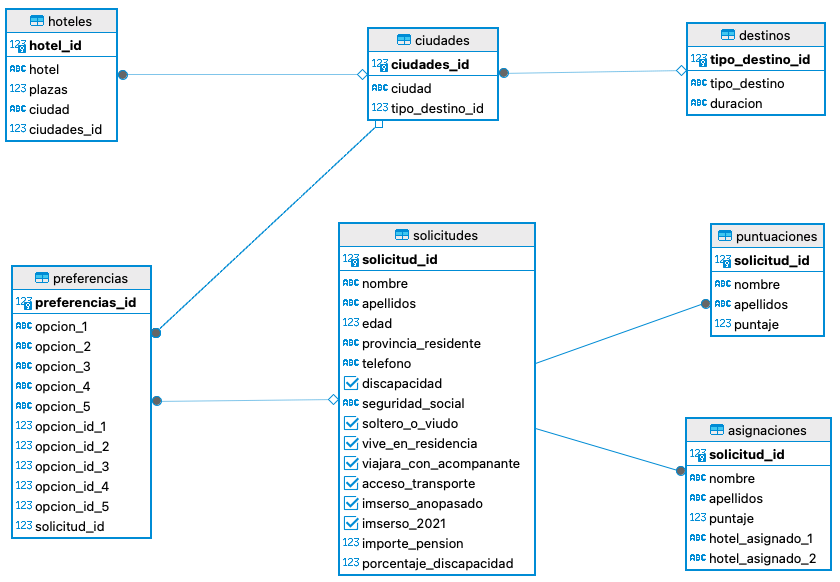

# **Data Project 1**
Este repositorio contiene toda la información del primer Data Project grupal del máster. El grupo está compuesto por Balma Agost, Borja Cabo, Javier Ruíz, Luis Segura e Inés Soler.

># Objetivos
El objetivo principal del proyecto es modernizar y hacer más justo el proceso de asignación de las plazas de hoteles ofrecidas por el Imserso. 
Para ello, hemos creado un sistema de puntuaciones basado en distintas variables que asignan mayor o menor preferencia a cada individuo a la hora de elegir plaza.

># Datos Utilizados
A continuación se pueden ver todos los datos que hemos utilizado y sus características.

| TABLA | VARIABLE | DESCRIPCIÓN | TIPO DE DATO | 
| ----- | -------- | ----------- | ------------ | 
| Solicitudes | solicitud_id | ID de solicitud individual. | bigint |
| Solicitudes | nombre | Nombre de cada solicitante. | varchar(50) |
| Solicitudes | apellidos | Apellidos de cada solicitante. | varchar(60) |
| Solicitudes | edad | Edad del solicitante. | smallint |
| Solicitudes | provincia_residente | Provincia de residencia del solicitante. | varchar(50) |
| Solicitudes | telefono | Teléfono de contacto del solicitante. | varchar(50) |
| Solicitudes | discapacidad | ¿Tiene alguna discapacida? | boolean |
| Solicitudes | porcentaje_discapacidad | Porcentaje de discapacidad (en caso de tener). | smallint |
| Solicitudes | seguridad_social | Número de la seguridad social del solicitante. | varchar(50) |
| Solicitudes | soltero_o_viudo | ¿El solicitante es soltero o viudo? |boolean |
| Solicitudes | vive_en_residencia | ¿Vive en una residencia de mayores? | boolean |
| Solicitudes | viajara_con_acompanante | ¿Viajará acompañado el solicitante? | boolean |
| Solicitudes | acceso_transporte | ¿Tiene acceso a transporte público o privado? | boolean |
| Solicitudes | imserso_anopasado | ¿Viajó con el programa del imserso en el periodo anterior (2022)? | boolean |
| Solicitudes | imserso_2021 | ¿Viajó con el programa del imserso en el año 2021? | boolean |
| Solicitudes | importe_pension | Importe de la pensión mensual que recibe el solicitante. | smallint |
| Destinos | tipo_destino_id | Identificador del tipo de destino | smallint |
| Destinos | tipo_destino | Tipo de destino: insular, peninsular o de escapada. | varchar(50) |
| Destinos | duracion | Duración de cada viaje según el tipo de destino al que corresponda. | varchar(15) |
| Ciudades | ciudades_id | ID de cada ciudad de destino. | bigint |
| Ciudades | ciudad | Ciudad de destino. | varchar(40) |
| Ciudades | tipo_destino_id | Unión con la tabla 'Tipo de destino'. | smallint |
| Preferencias | solicitud_id | ID de solicitud, correspondiente a la tabla 'Solicitudes' | bigint |
| Preferencias | preferencias_id | ID individual para cada conjunto de elecciones. | bigint |
| Preferencias | opcion_1 | Primera opción de destino del solicitante. | varchar(40) |
| Preferencias | opcion_2 | Segunda opción de destino del solicitante. | varchar(40) |
| Preferencias | opcion_3 | Tercera opción de destino del solicitante. | varchar(40) |
| Preferencias | opcion_4 | Cuarta opción de destino del solicitante. | varchar(40) |
| Preferencias | opcion_5 | Quinta opción de destino del solicitante. | varchar(40) |
| Preferencias | solicitud_id | ID de cada solicitante, correspondiente a la tabla 'solicitudes' | bigint |
| Hoteles | hotel_id | ID individual de cada hotel. | bigint |
| Hoteles | hotel | Nombre de los hoteles disponibles para los viajes del imserso. | varchar(60) |
| Hoteles | plazas | Número de plazas disponibles en cada hotel para los viajes del imserso. | smallint |
| Hoteles | ciudad | Ciudad donde se encuentra cada hotel. | varchar(40) |
| Hoteles | ciudades_id | ID de la ciudad donde está situado el hotel. Unión con la tabla 'ciudades'. | bigint |

Al aplicar los puntajes, se genera otra tabla que contiene las siguientes columnas:

| TABLA | VARIABLE | DESCRIPCIÓN | TIPO DE DATO | 
| ----- | -------- | ----------- | ------------ | 
| Puntuaciones | solicitud_id | ID del solicitante. Unión con la tablas 'solicitudes' | bigint |
| Puntuaciones | nombre | Nombre de cada solicitante. | varchar(50) |
| Puntuaciones | apellidos | Apellidos de cada solicitante. | varchar(60) |
| Puntuaciones | puntaje | Puntaje individual según las características del solicitante. | smallint |

Una vez definidos los putajes para cada solicitante, podemos crear otra tabla en la que se muestran los hoteles que se han asignado a cada solicitante. La tabla contiene los siguientes campos:
| TABLA | VARIABLE | DESCRIPCIÓN | TIPO DE DATO | 
| ----- | -------- | ----------- | ------------ | 
| Asignaciones | solicitud_id | ID del solicitante. Unión con la tablas 'solicitudes' | bigint |
| Asignaciones | nombre | Nombre de cada solicitante. | varchar(50) |
| Asignaciones | apellidos | Apellidos de cada solicitante. | varchar(60) |
| Asignaciones | puntaje | Puntaje individual según las características del solicitante. | smallint |
| Asignaciones | hotel_asignado_1 | Nombre del primer hotel que se le ha asignado al solicitante. | varchar(150) |
| Asignaciones | hotel_asignado_2 | Nombre del segundo hotel que se le ha asignado al solicitante. | varchar(150) |

># Origen de los Datos
Los datos han sido creados mayoritariamente de forma aleatoria haciendo uso de la librería 'faker' y del módulo 'random' de Python.
De los datos creados aleatoriamente, los siguientes han sido delimitados basándonos en información real:
- La edad solo puede estar en el rango de 60 a 99 años.
- El importe de las pensiones está en el rango entre 480 y 3,000€, que es el rango real de las pensiones en España.
- El porcentaje de discapacidad contempla hasta el 85%, ya que con un porcentaje superior a este se considera que la persona no está capacitada para viajar.
- Las plazas de hotel disponibles están basadas en los rangos reales de ocupación media de los hoteles españoles.

Por otra parte, los datos referentes a los diferentes tipos de destino y las posibles ciudades de cada tipo han sido extraidas de la siguiente página web: [Programa de Turismo Social del IMSERSO](https://www.turismosocial.com/Nuestros-Destinos/Listado-destinos~~.html?tourCat=Costa-Insular).

Y finalmente, hemos obtenido los datos de los hoteles que actualmente participan en el programa del IMSERSO: [Lista de Hoteles](https://www.preferente.com/noticias-de-hoteles/imserso-lista-completa-de-los-235-hoteles-de-mundiplan-y-turismo-social-321200.html)

># Variables incluidas en el Sistema de Puntuaciones
Para el sistema de puntuaciones, se han seleccionado las variables más relevantes, bajo nuestro punto de vista, y a cada una se le ha asignado un puntaje dependiendo del valor que tome para cada solicitante.

| VARIABLE | VALORES | PUNTOS | 
| -------- | ------- | ------ |  
| Edad | 65 -75 años | 10 puntos |
|      | 76 - 85 años | 15 puntos |
|      | > 85 años | 20 puntos |
| Viudedad | True | 10 puntos |
| Discapacidad | 30% - 41% | 5 puntos |
|              | 42% - 53% | 10 puntos |
|              | 54% - 65% | 15 puntos |
|              | 66% - 77% | 20 puntos |
|              | > 77% | 25 puntos |
| Acceso a transporte | True | 1 punto |
|                     | False | 5 puntos |
| Residencia de mayores | True | 15 puntos |
| Comunidad Autónoma | Comunidad Valenciana, Murcia y Andalucía | 1 punto |
|                    | Cataluña, Galicia, Asturias y País Vasco | 2 puntos |
|                    | Extremadura | 3 puntos |
|                    | Madrid | 4 puntos | 
|                    | Aragón, La Rioja, Navarra y Cantabria | 5 puntos |
|                    | Castilla y León | 6 puntos |
|                    | Baleares, Canarias, Ceuta y Melilla | 7 puntos |
| Pensión | 480€ - 996€ | 35 puntos |
|         | 997€ - 1513€ | 20 puntos |
|         | 1514€ - 2030€ | 10 puntos |
|         | 2031€ - 2547€ | 5 puntos |
|         | > 2548€ | 1 punto |
| Programas Anteriores | 2022 & 2021 | 1 punto |
|                      | 2022 | 5 puntos |
|                      | 2021 | 10 puntos |
|                      | Ninguno | 25 puntos |

># Modelo de datos

Tabla Solicitudes
solicitud_id (clave primaria)
nombre
apellidos
edad
provincia_residente
telefono
discapacidad
seguridad_social
soltero_o_viudo
vive_en_residencia
viajara_con_acompanante
acceso_transporte
imserso_anopasado
imserso_2021
importe_pension
porcentaje_discapacidad
Tabla Destinos
tipo_destino_id (clave primaria)
tipo_destino
duracion
Tabla Ciudades
ciudades_id (clave primaria)
ciudad
tipo_destino_id (clave foránea referenciando a la tabla Destinos)
Tabla Preferencias
preferencias_id (clave primaria)
opcion_1
opcion_2
opcion_3
opcion_4
opcion_5
opcion_id_1 (clave foránea referenciando a la tabla Ciudades)
opcion_id_2 (clave foránea referenciando a la tabla Ciudades)
opcion_id_3 (clave foránea referenciando a la tabla Ciudades)
opcion_id_4 (clave foránea referenciando a la tabla Ciudades)
opcion_id_5 (clave foránea referenciando a la tabla Ciudades)
solicitud_id (clave foránea referenciando a la tabla Solicitudes)
Tabla Hoteles
hotel_id (clave primaria)
hotel
plazas
ciudad
ciudades_id (clave foránea referenciando a la tabla Ciudades)
Este modelo refleja la estructura de las tablas y las relaciones entre ellas. La información se organiza de manera que puedes relacionar las preferencias con las ciudades, las ciudades con los destinos, y los hoteles con las ciudades. Además, las solicitudes están relacionadas con las preferencias. Cada tabla tiene una clave primaria única, y las claves foráneas se utilizan para establecer relaciones entre las tablas.

